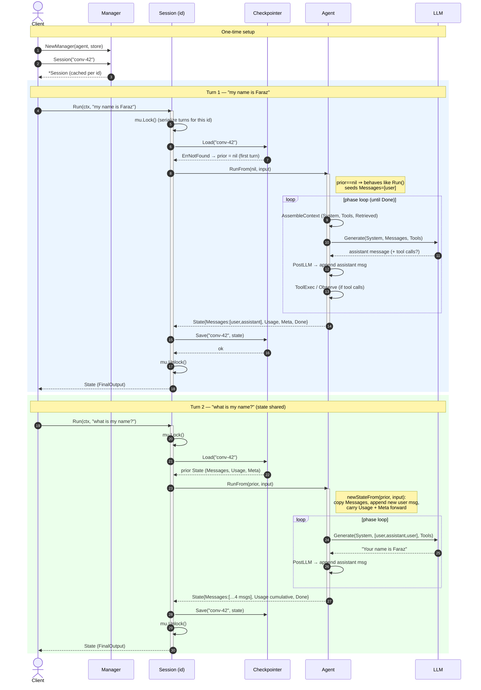

# Sessions

A **session** is a keyed, durable, multi-turn conversation built on top of a
single shared `*gantry.Agent`. The agent itself is stateless across turns — all
conversation state lives in a `Checkpointer`, keyed by session id. This is what
makes state shared across every message in a session.

For the component overview see the [reference](reference.md); for the API see the
[`session` package docs](../session/doc.go). For how sessions relate to the
planned **Task** layer for long-running autonomous work, see
[Sessions & Task Management](task-management.md).

## How it works

Each turn follows the same contract, serialized per session id by a mutex:

```
Load(id) → agent.RunFrom(prior, input) → Save(id)
```

The store is the single source of truth, so a fresh `Manager` over the same
store and id resumes a conversation transparently — including across process
restarts when backed by a durable `Checkpointer`.



## Walkthrough

### Setup (once)

Create a `Manager` by pairing one shared `Agent` with a `Checkpointer` (the
durable store). `Manager.Session("conv-42")` returns a `Session` handle keyed to
that id; the manager caches the handle, so asking for the same id again returns
the same object (and shares its per-session mutex).

### Turn 1 — "my name is Faraz"

1. **`Session.Run(ctx, "my name is Faraz")`** kicks off one turn.
2. **Load.** The session asks the checkpointer for state under `"conv-42"`.
   Nothing exists yet, so `Load` returns `ErrNotFound`, treated as a normal
   first turn — `prior = nil`.
3. **RunFrom.** With `prior == nil`, `Agent.RunFrom` behaves exactly like a
   fresh `Run`: it seeds the conversation with a single user message,
   `Messages = [user: "my name is Faraz"]`.
4. **Phase loop.** The agent runs its normal loop — assemble context, call the
   LLM, append the assistant reply, run any tool steps — until the turn is done.
5. **Result.** The agent returns a `State` with the full transcript
   `[user, assistant]`, token `Usage`, the `Meta` map, and `Done = true`.
6. **Save.** The session writes that whole `State` back under `"conv-42"`.

The key idea: **at the end of the turn, the entire conversation is persisted,
not just the latest message.**

### Turn 2 — "what is my name?"

1. **`Session.Run(ctx, "what is my name?")`** starts the next turn.
2. **Load.** The store now has state for `"conv-42"`, so it returns the prior
   `State` — the two messages from turn 1 plus accumulated `Usage` and `Meta`.
3. **RunFrom with prior.** `RunFrom` builds the next turn via `newStateFrom`: it
   **copies the prior messages, appends the new user message**, and **carries
   `Usage` and `Meta` forward**. The agent now sees
   `[user: "my name is Faraz", assistant: "...", user: "what is my name?"]`.
4. **Phase loop.** The LLM is called with that full history — which is *why* it
   can answer "Your name is Faraz." The model isn't remembering anything; the
   session re-supplies the entire prior conversation on every turn.
5. **Save.** The grown transcript (now four messages) and cumulative usage are
   written back under the same id.

### In one sentence

Each turn is **Load the saved state → append the new message and run → Save the
result**. The conversation "memory" isn't in the model or the agent — it's the
`State` blob the checkpointer persists and reloads under the session id.

## Session vs. memory

Both carry a transcript across runs, but they are used **alternatively, never
stacked** for the same transcript:

- **memory** — implicit, single, unkeyed transcript baked into one agent via
  `memory.New`. Best for one long-lived in-process conversation.
- **session** — explicit, keyed, durable; the transcript lives in the per-id
  `State` carried by `RunFrom`. Best for many conversations and/or persistence.

The agent attached to a `Manager` MUST NOT also carry `memory.New` or
`checkpointer.New`: the `Session` owns load/save, and memory would
double-manage the transcript.

## Caveats

- **Single-process serialization.** The `Session` mutex and the `Manager` handle
  cache are per-process. Two processes sharing one store have no cross-process
  lock, so concurrent turns on the same id can race (load-modify-save) and
  silently clobber a turn.
- **Save only at turn end.** State is persisted at `PhaseEnd`. A crash mid-turn
  (e.g. during a long multi-iteration tool sequence) loses that turn; `Resume`
  is a no-op against a checkpointer that only saves terminal state.
